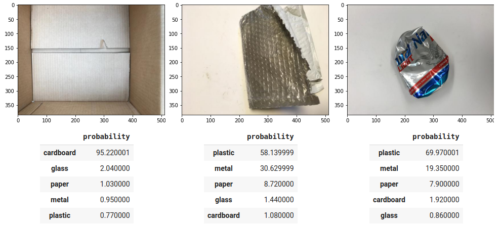

# trash_detector

Waste segregation is a huge issue in a modern world, where consumptionism is a basic mechanism in a social functioning. Although ecological movements are founded and pushed, new trends like 'no waste' are being defined and the awareness of responsibility for our planet is drilled into new generations, we still need to encouter decades of produced waste, a legacy of our grandparents and parents.

This task is however ideal to be addressed with modern technology. Robotics and deep learning are separate fields that mix well. And the state-of-the-art solutions known nowadays are all set to solve waste segregation dilemma.

This project is a preliminary research for solutions that can be developed for the case. Its purpose is to raise awareness of what modern technology is capable of and how it can be achieved. It is not a SoA approach intended to be commisioned to the production.

Two Convolutional Neural Networks are trained and evaluated - ResNet50 (2015) and EfficientNetB4 (2019). The idea is to use transfer learning and achieve promising results with popular and free tools - Python, Tensorflow, Kaggle datasets and Google Colab. The goal is to develop a working CNN model, that solves the classification problem of waste in 5 categories: cardboard, glass, paper, metal and plastic.

## Dataset
The Garbage Classification Dataset contains 6 classifications: cardboard (393), glass (491), metal (400), paper(584), plastic (472) and trash(127).\
https://www.kaggle.com/asdasdasasdas/garbage-classification

'trash' category was dropped out as it contained significantly less samples than other categories and did not provide any useful information in waste sergregation process.
Train/test division was rearranged so that each category contains 100 samples for testing. This results in ~20% train/test split size. Data augmenation is used in order to generate more samples for learning process.
## Model performance
**ResNet50** accuracy score: 0.678\
**EfficientNetB4** accuracy score: 0.898

EfficientNetB4 confusion matrix and categorical accuracy

## Classification samples

Achieved examples of good classification, sufficient classification and misclassification.
